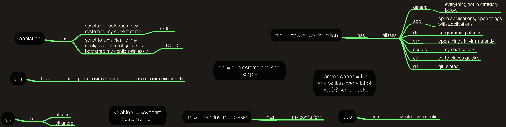
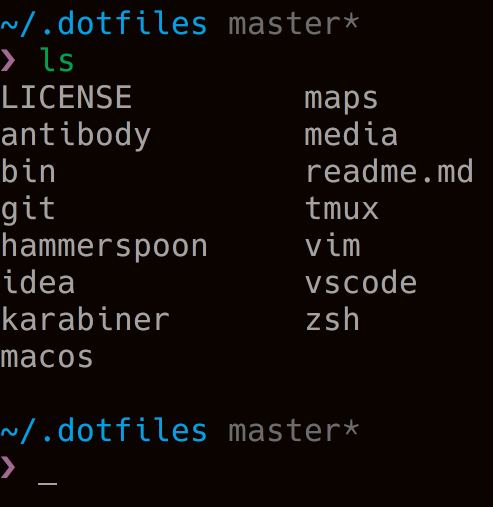

<h1 align="center"><a href="https://my.mindnode.com/3EfbezxGu7xVAM4GQNuN8Lq1naudqs333HqgTuDj">My configuration files for macOS 🐚 </a></h1>

<div align="center">
<a href="https://www.patreon.com/nikitavoloboev">
		
	</a>
	<a href="https://github.com/nikitavoloboev/dotfiles/blob/master/LICENSE">
		
	</a>
</div>
  
<a align="center" href="https://my.mindnode.com/3EfbezxGu7xVAM4GQNuN8Lq1naudqs333HqgTuDj">
    </a>    

<h1 align="center"> Description 📕</h1>


These are the various configuration files I use on macOS. I wrote about how I customise and use my shell in article [here](https://medium.com/@NikitaVoloboev/pretty-and-fast-shell-97ea870f2805).

You can also see my top used applications, safari exensions and alfred workflows I use [here](https://github.com/nikitavoloboev/my-mac-os).


<h1 align="center"><a href="https://my.mindnode.com/c7EmmKvaxCyCEuTzcpkGB4MGeLpWdR8nsJK4rjDh">Karabiner ⌨</a></h1>

The most exciting thing in here is probably how I utilise [Karabiner](https://pqrs.org/osx/karabiner/). It has absolutely transformed the way I interact with my computer and there is no going back now. 

I document all the keybindings I have made and changed as an interactive mind map [here](https://my.mindnode.com/c7EmmKvaxCyCEuTzcpkGB4MGeLpWdR8nsJK4rjDh). Scroll around and explore, perhaps you find something interesting.

<h1 align="center">Neovim 🌻</a></h1>

I am [still learning vim](https://my.mindnode.com/24sx5yV3S7FLayi5Msvhysx5HZ8aAPzUqJ6rStKi) but the this journey has been very rewarding. Modal editing is pretty amazing. 

My main editor of choice is [VS Code](https://github.com/Microsoft/vscode) since it also has very well built [vim mode](https://github.com/VSCodeVim/Vim).

<h1 align="center">Hammerspoon 🔨</a></h1>

I don't use [hammerspoon](http://www.hammerspoon.org/) as extensively however I am looking into implementing more of its features into my workflow.

<h1 align="center">zsh 🐚</h1>

I also am using [zsh](http://www.zsh.org) as my shell with [antibody](https://github.com/getantibody/antibody) plugin manager. 

Here is how my prompt looks currently : 

<p align="center"></p>

<h1 align="center">zsh aliases 🐚</h1>

I use many aliases to get around my system as fast as possible.

Similar to my Karabiner config, I keep a list of all aliases that I have with their descriptions in an interactive mind map you can view [here](https://my.mindnode.com/upnFQeGrQCPwgCf3pfS4FgywQUj5sXNLxb1awm1D).

<h1 align="center">interesting aliases and zsh functions 🐚</h1>

There is quite a lot of awesome programs I use from my command line (you can see [here](https://github.com/nikitavoloboev/my-mac-os#command-line-apps-) for some of them).

However I also really love customising my shell experience with various aliases and zsh functions. Here are some that I like and use very often.

```Bash
function ggi() {
    git init
    mit
    git add .
    git commit -m "🌅"
    git remote add origin $(osascript -e 'tell application "Safari" to return URL of front document')
    git push -u origin master
}
```

Say I created some project and wrote some code in it or added a simple README with some text in it. I then go on to create a [new GitHub repository](https://github.com/new) and give it a name. After that I just run this `ggi` command.

It will initialise my current directory with git if it wasn't already. It will then call this function : 

```Bash
function mit() {
  license-up Nikita Voloboev nikitavoloboev.xyz
  git add LICENSE
  git commit -m 'MIT license'
}
```

Which using [this CLI tool](https://github.com/nikitavoloboev/license-up), will create a license file and git commit it. After that it will add all the remaining files with a commit message you like, take the URL of my current browser window which will be at the newly created repository, point the local git repo to push there and push it. 

And thus in one command I initialised and pushed the repo. To create a new repo quickly I use [this Alfred workflow](https://github.com/nikitavoloboev/alfred-ask-create-share).

<h1 align="center"> Thanks 🍀</h1>

You can support what I do on [Patreon](https://www.patreon.com/nikitavoloboev) or look [into other repositories](https://my.mindnode.com/ZKGETDkUaQUsL3q8q9z788CxG84oEHgDiT79GuzX#-191.2,-905.2,2) I shared. Thank you. 💛 